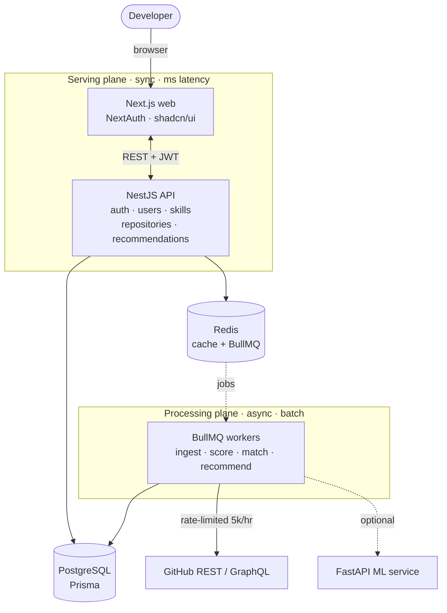

<div align="center">

# 🧭 OpenPath

### Find your next open-source contribution — matched to your skills.

OpenPath ingests GitHub repositories and issues, scores their **health** and **difficulty**, and ranks the ones that best fit a developer's skill profile — so contributing to open source starts with the *right* issue, not hours of scrolling.

<p>
  
  
  
  
  
  
  
  
</p>

<sub><a href="#-why-a-pipeline-not-a-search-bar">Why</a> • <a href="#️-architecture">Architecture</a> • <a href="#-features">Features</a> • <a href="#-tech-stack">Tech stack</a> • <a href="#-quick-start">Quick start</a> • <a href="#️-roadmap">Roadmap</a></sub>

</div>

---

## 🧠 Why a pipeline, not a search bar?

You can't analyze "millions of repositories" live — GitHub's API caps at **~5,000 requests/hour**. So OpenPath is **not a live-search wrapper; it's a data pipeline**:

1. **Ingest** repos & issues into PostgreSQL via rate-limited background workers (offline).
2. **Score** them in batch — repository health, issue difficulty, skill fit.
3. **Serve** recommendations by reading *precomputed* data — fast, no live API calls.

> This is the single architectural decision everything else follows from. See [`TECHNICAL_PLAN.md`](./TECHNICAL_PLAN.md) for the full design and [`docs/RESEARCH.md`](./docs/RESEARCH.md) for the evaluation plan.

## 🏛️ Architecture

Three planes running on different clocks — synchronous serving, asynchronous processing, and external data:



## ✨ Features

- 🔐 **GitHub sign-in** — Auth.js (NextAuth v5) on the web, exchanged for a short-lived **JWT** at the API; GitHub access tokens stored **AES-256-GCM encrypted**.
- 📥 **Rate-limited ingestion** — BullMQ workers pull repos & issues from GitHub REST/GraphQL while respecting the 5k/hr budget.
- 🧬 **Skill taxonomy & matching** — a normalized skill catalog with aliases (`js → JavaScript`, `k8s → Kubernetes`) powers profile-to-repo matching.
- 🩺 **Repository health scoring** — a transparent weighted composite over activity, maintainers, community, and documentation.
- 🎚️ **Issue difficulty** — heuristic classification of issues into difficulty levels, surfaced as difficulty chips in the UI.
- 🎯 **Precomputed recommendations** — a worker ranks repositories per user (skill match + health + fit); the API just reads and returns them.
- 🖥️ **Polished web app** — profile, recommendation feed, repository browser + detail pages, dark/light themes, and mobile-responsive shadcn/ui.
- 🐍 **ML service** — a Python/FastAPI service for the research models (difficulty v2, success prediction) — early scaffold.

## 🧰 Tech stack

| Layer | Technologies |
| ----- | ------------ |
| **Web** | Next.js · React · TypeScript · Tailwind CSS · shadcn/ui · Auth.js (NextAuth v5) |
| **API** | NestJS · Prisma · JWT · AES-256-GCM token encryption |
| **Workers** | BullMQ · GitHub REST/GraphQL client |
| **Data** | PostgreSQL · Redis |
| **ML** | Python · FastAPI |
| **Tooling** | npm workspaces · Docker Compose · TypeScript project references |

## 🗂️ Monorepo structure

```
openpath/
├─ apps/
│  ├─ web/       Next.js frontend — port 3000  (NextAuth · shadcn/ui)
│  ├─ api/       NestJS API — port 4000, prefix /api  (Prisma · JWT · BullMQ)
│  └─ worker/    BullMQ workers — ingestion · scoring · matching · recommend
├─ packages/
│  └─ db/        Prisma schema + seed + shared client (@openpath/db) + skill catalog
├─ services/
│  └─ ml/        Python / FastAPI model service — port 8000  (Phase 5)
├─ docs/         RESEARCH.md — evaluation plan
├─ docker-compose.yml
└─ TECHNICAL_PLAN.md
```

## 🚀 Quick start

**Prerequisites:** Node.js ≥ 20 · PostgreSQL + Redis (Docker or managed) · Python ≥ 3.11 *(only for `services/ml`)*

```bash
# 1 — Install & configure
npm install
cp .env.example .env          # fill in GitHub OAuth creds + secrets

# 2 — Database & Redis (pick one)
docker compose up -d          # A) local Postgres + Redis with the .env defaults
#  …or B) free managed tiers: Neon (DATABASE_URL) + Upstash (REDIS_URL)

# 3 — Prisma client + schema
npm run db:build              # prisma generate + build @openpath/db
npm run db:migrate            # create tables
npm run db:seed               # optional: seed the skill taxonomy

# 4 — Run (three terminals)
npm run dev:api               # → http://localhost:4000/api/health
npm run dev:web               # → http://localhost:3000
npm run dev:worker            # ingestion · scoring · recommend
```

> **GitHub OAuth callback URL:** `http://localhost:3000/api/auth/callback/github`
> Create an app at **GitHub → Settings → Developer settings → OAuth Apps** and set `GITHUB_CLIENT_ID` / `GITHUB_CLIENT_SECRET` in `.env`.

## 🧩 What the API exposes

| Route | Purpose |
| ----- | ------- |
| `GET /api/health` | Liveness check (the web home page pings this) |
| `/api/auth` | GitHub OAuth → app JWT, current user |
| `/api/users` · `/api/skills` | Profile & skill taxonomy |
| `/api/repositories` | Browse & inspect ingested repositories and their issues |
| `/api/recommendations` | Precomputed, ranked matches for the signed-in user |

## 🗺️ Roadmap

Current state of the codebase (✅ implemented · ⏳ in progress):

- ✅ **Phase 0** — Monorepo, Docker Compose, NestJS + Next.js skeletons, GitHub OAuth
- ✅ **Phase 1** — Prisma schema, skill taxonomy, rate-limited ingestion workers
- ✅ **Phase 2** — Repository health scoring + issue difficulty (v1 heuristics)
- ✅ **Phase 3** — Skill matching + precomputed recommendations
- ✅ **Phase 4** — Web MVP: profile, recommendation feed, repo/issue detail, shadcn/ui
- ⏳ **Phase 5** — ML models (difficulty v2, contribution-success prediction) + evaluation
- ⏳ **Phase 6** — Trending, learning paths, thesis polish

## 📚 Documentation

- [`TECHNICAL_PLAN.md`](./TECHNICAL_PLAN.md) — architecture, data model, scoring engines, phases
- [`docs/RESEARCH.md`](./docs/RESEARCH.md) — evaluation plan (ground truth & metrics)
- [`services/ml/README.md`](./services/ml/README.md) — ML service notes

---

<div align="center">
<sub>An M.Tech research project · built by <a href="https://github.com/kruxshnx">@kruxshnx</a></sub>
</div>
